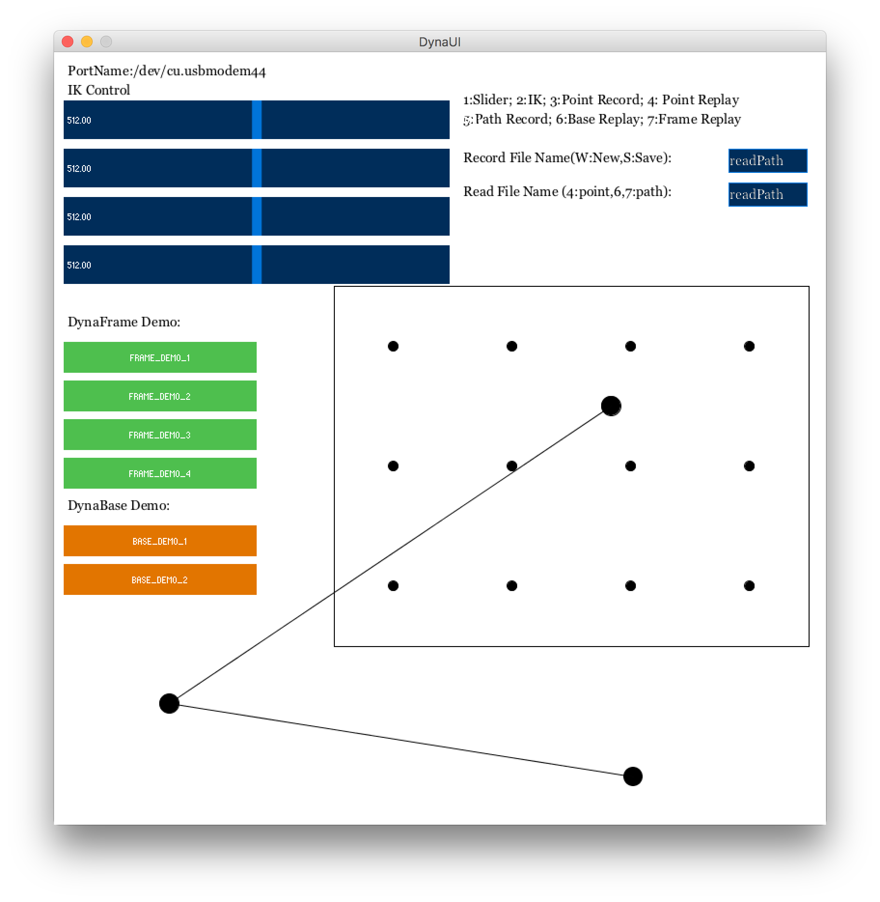

# Stylus Assistant: Designing Dynamic Constraints for Facilitating Stylus Inputs on Portable Displays

## Project Introduction
This work, Stylus Assistant, proposed two designs of actuator array system, **DynaFrame** and **DynaBase**, to realize dynamic physical constraints on portable displays for facilitating stylus input.

## DynaFrame

## User Interface

## File Description
* **DynaArd** - Arduino Code
* **DynaUI** - Processing Code
* **Models** - SketchUp and Illustrator files
* **SetID** - Dynamixel AX-18A Motor ID Setting
* **Doc** - Documents

## Project Documents
* Original Version: [Google Doc](https://docs.google.com/document/d/1mkmDp4YyBh0SwKKhiSD5-HdVlsP8pnFafbvmv74smBk/edit?usp=sharing) / [PDF](Doc/StylusAssistantDocument.pdf)
* Demo Version: [Google Doc](https://docs.google.com/document/d/1DRZvKb9pZrIUMAFr76vTpBE7sWNrNrS9NaeW5d6-lQI/edit?usp=sharing)

## Author

Long-Fei Lin, National Taiwan University
